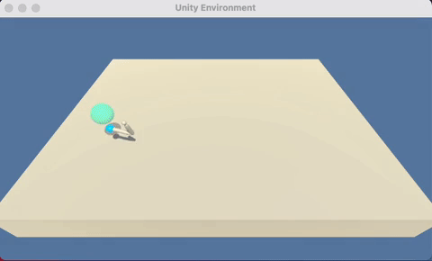

# Continuous Control
This is the P2 project for the Deep Reinforcement Learning Nanodegree on https://www.udacity.com/.

The goal of this project is to create an agent that can be trained to maintain a double-jointed arm on a target location for as many time steps as possible. A reward of 0.1 is given for every step that the agent's hand is on the goal location.

The state space is comprised of 33 dimensions corresponding to position, rotation, velocity, and angular velocities of the arm. The action space is a 4 number vector corresponding to torque applicable to the 2 joints. Every number in the action space is between `-1` and `1`.

The problem is solved once the agent has achieved an average score of 30 over the last 100 episodes. An example of a trained agent can be seen below:

## Getting started
This was built and **tested on MacBook Pro M1 chip only**.

 1. Clone this project. `git clone https://github.com/bigbap/Udacity_DRL_Continuous_Control.git`
 2. Download banana environment from https://drive.google.com/file/d/1vU6aa33KALzQcb43s68OV2mnoh8-Wk2G/view?usp=sharing
 3. extract the contents of the downloaded environment into the cloned project directory.

You will need to install Anaconda from https://www.anaconda.com/products/individual. Once Anaconda is installed, open up the terminal and type the following commands to create a new environment:

 1. `conda create --name continuous python=3.6`. This will create a new environment called **continuous** where we will install the dependencies.
 2. `conda activate continuous`. This will activate the environment we just created.

Now we can install the dependencies:

 1. `pip3 install unityagents`. Should be version 0.4.0
 2. `pip3 install torch`. Should be version 1.9.1

## Training the model
Open `Continuous_Control.ipynb` with **Jupyter Notebook** and follow the instructions to train a new agent.

If you want to watch the trained agent playing, open `Continuous_Control_Play.ipynb` with **Jupyter Notebook** and follow the instructions.

*Note: if you get any errors, please ensure that you have followed all the instructions in the **Getting started** section. Pay special attention to the dependencies and their versions. If you are not sure what packages you have installed, use `conda list` to list all the installed packages and their versions for the activated environment*
