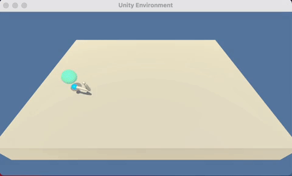
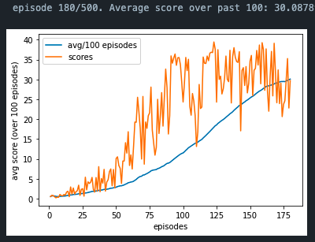

# Report for Continuous Control - Deep RL NanoDegree P2

The goal of this project is to create an agent that can be trained to maintain a double-jointed arm on a target location for as many time steps as possible.

The environment is solved once the agent has accumulated an average score of 30 over 100 episodes. An example of a trained agent can be seen below:

## 1. Implementation
I used the `DDPG` algorithm, with a `uniformly sampled experience replay buffer`.

### 1.1. Neurals Nets
There are 2 neural  networks. One for the actor and the critic. Bearing in mind that the environment has `state_space_n = 33` and `action_space_n = 4`, each neural net has the following layers:

**Actor**
- `input layer = linear(state_space_n, 128)`
- `hidden layer = linear(128, 128)`
- `output layer = linear(128, action_space_n)`

The input and hidden layers pass through a `leaky_relu` activation function, and the output layer passes through a `tanh` in the forward pass.

**Critic**
- `input layer = linear(state_space_n, 128)`
- `hidden layer = linear(128 + action_space_n, 128)`
- `output layer = linear(128, 1)`

The input and hidden layers pass through a `leaky_relu` activation function. The output layer is a linear value function. The `action_space_n` is concatenated to the input of the `hidden layer`.

### 1.2. Hyper-parameters
- BATCH_SIZE = 64           mini-batch size
- REPLAY_LENGTH = 10000     replay buffer max length
- LEARN_EVERY = 1           learning interval
- GAMMA = 0.99              discount factor
- TAU = 1e-3                amount of local network to copy to target in soft update
- LR_ACTOR = 2e-4           learning rate for the actor network
- LR_CRITIC = 2e-4          learning rate for the critic netowork
- WEIGHT_DECAY = 0          L2 penalty

## 2. Learning Plot
The environment was solved in 180 episodes as can be seen in the plot below.

## 3. Ideas for the Future
- Prioritized experience replay. I tried implementing a prioritized experience replay but it didn't seem to be making much of difference and there was a bug that cause the agent to crash if `WEIGHT_DECAY` was set to 0. In the interest of time, I reverted back to a uniformnly sampled replay buffer. If I had more compute power, I would have spent more time on this.